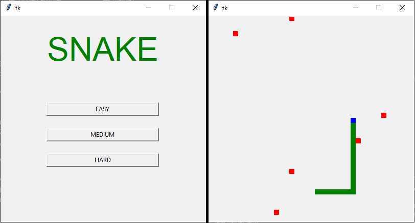

<div id="title" align="center">
  <h1>SNAKE</h1>
  <h4>Jeu du <a href="https://fr.wikipedia.org/wiki/Snake_(genre_de_jeu_vid%C3%A9o)">Snake</a> en python3 avec tkinter</h4>
  
  
</div>

## But
Manger toutes les pommes du niveau pour accèder au niveau supérieur.

## Règles
Le joueur perd s'il fonce dans un mur ou s'il essaie de se manger.<br>
Quand le serpent mange une pomme, il grandit de 3 cases.<br>
Il faut utiliser les flèches directionnelles pour choisir la direction du serpent.<br>
<br>
On peut choisir entre 3 difficultés différentes (la difficulté change la taille de l'écran) :
- Facile (800x800)
- Moyen (600x600)
- Difficile (400x400)

## Execution du programme
```python
python Main.py
```
